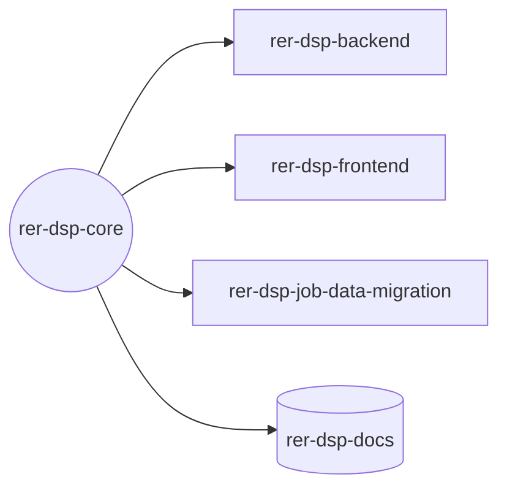

# rer-dsp-core

> Este repositório é um dos módulos do **DSP (Data Sharing Platform)**, parte do ecossistema RER.
> A documentação completa do projeto está em **[rer-dsp-docs](https://github.com/Rural-Environmental-Registry/rer-dsp-docs)**.
> As informações abaixo tratam apenas deste módulo, não do projeto DSP como um todo.

## Qual parte do DSP este módulo é



## Objetivo

Orquestra, via Docker Compose, os bancos de dados (PostgreSQL/PostGIS), o GeoServer, o gateway e a
configuração do adotante para toda a stack DSP.

## Responsabilidades

- Subir e configurar os bancos de dados (`dsp-db`, `dsp-geoserver-db`)
- Subir o GeoServer de exibição (WMS)
- Subir o gateway nginx (`dsp-gateway`), porta de entrada única da stack
- Guiar a configuração do adotante (hierarquia, telas, KPIs, camadas do mapa,
  página About)
- Orquestrar os demais módulos via Docker Compose

## Tecnologias

Docker Compose, PostgreSQL/PostGIS, GeoServer, nginx, Bash, Python.

## Pré-requisitos

| Ferramenta | Versão | Uso |
|------------|--------|-----|
| Git | 2.x+ | Clonar repositórios irmãos (automático ou manual), se ainda não existirem |
| Docker | 24+ com Compose v2 | Subir bancos, GeoServer e módulos |
| Python | 3 | Wizard `./config.sh` |

## Como executar

Clone apenas o core e siga os scripts. Os demais repositórios podem ser clonados
automaticamente quando ausentes (`./config.sh`, `./setup.sh` e `./start.sh` exibem
a estrutura de pastas antes de confirmar o clone). O `.env` é criado automaticamente
a partir de `.env.example` na primeira execução.

```bash
git clone https://github.com/Rural-Environmental-Registry/rer-dsp-core.git
cd rer-dsp-core
./config.sh
./setup.sh
./start.sh
```

### Fluxo de configuração

```text
./config.sh
    │
    ▼
Configura o adotante
(JDBC, L1/L2/L3/AOI, layers opcionais, UI)
    │
    ▼
./setup.sh
    │
    ├─► Demonstration (seed embutido, sem JDBC)
    │
    └─► Real adopter
            │
            ▼
    When should the initial migration run?
            │
      ┌─────┴─────┐
      ▼           ▼
   Run now    Schedule for later
      │           │
      └─────┬─────┘
            ▼
    How should it run?
            │
      ┌─────┴─────┐
      ▼           ▼
   One-time    Continuous
```

- `./config.sh` — configura somente o adotante (dados, mappings, camadas, interface, credenciais SeaweedFS no `.env`). **Não** pergunta horário de job batch.
- `./setup.sh` — escolhe demonstração ou adotante real; no adotante real, define **quando** e **como** a migração roda e o cron da **pré-geração** de arquivos (`DSP_GEO_FILE_GENERATION_CRON` no `.env`).
- `./start.sh` — sobe a stack usando a configuração já definida (não pergunta agendas de job).

No wizard do `./config.sh`, L1, L2, L3 e AOI são sempre configurados; generic layers são opcionais (`etl.layers`). O `application.yaml` do job recebe `execution-jobs` derivados automaticamente (jobs estruturais sempre `true`; `layer-jobs` só quando houver generic layers).

Ao final, tudo é acessível por uma única porta (default `8026`):

| Serviço | URL |
|---------|-----|
| Frontend | http://localhost:8026/dsp/ |
| Backend API | http://localhost:8026/dsp-backend |
| GeoServer Exhibition | http://localhost:8026/geoserver-exhibition/web/ |
| GeoServer Download | http://localhost:8026/geoserver-download/web/ |

Detalhes de rotas e cache: [`config/Gateway/docker/README.md`](config/Gateway/docker/README.md).

Estrutura esperada após o setup (layout padrão):

```text
DSP/
├── rer-dsp-core/
├── rer-dsp-backend/
├── rer-dsp-frontend/
└── rer-dsp-job-data-migration/
```

## Licença

[GNU General Public License v3.0](LICENSE)
